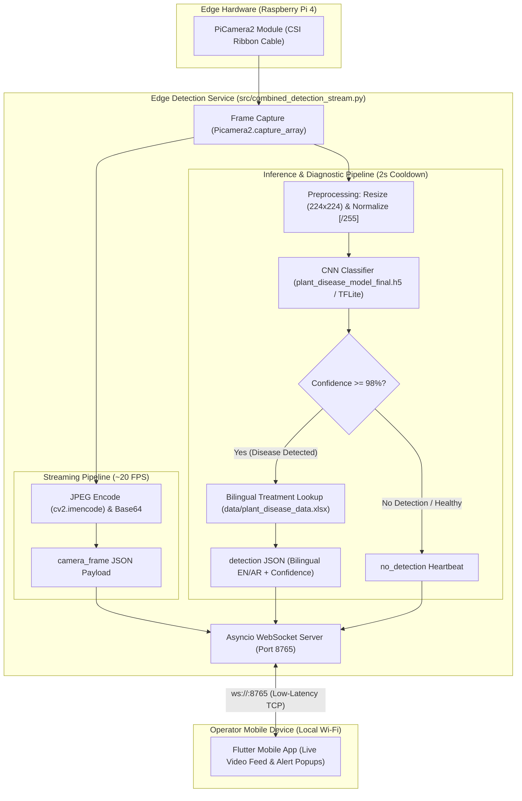

<div align="center">
  <h1>🌾 Farmer Eye Robotic Car</h1>
  <h3>Smart Vehicle for Crops Health Detection and Classification Using AI-powered and IoT</h3>
  
  <p align="center">
    <a href="https://github.com/mariiammaysara/FarmerEye/actions/workflows/tests.yml">
      
    </a>
    
    
    
    <a href="LICENSE">
      
    </a>
  </p>

  <p align="center">
    
  </p>

  <p align="center">
    <b>An end-to-end precision agriculture system combining edge AI, mobile robotics, and IoT to detect crop diseases in real time.</b>
  </p>
</div>

---

## 📖 Table of Contents

- [Project Overview](#-project-overview)
- [Documentation Hub](#-documentation-hub)
- [Key Features](#-key-features)
- [System Architecture](#-system-architecture)
- [Quick Start Guide](#-quick-start-guide)
- [Benchmark Results](#-benchmark-results)
- [Hardware & Wiring Summary](#-hardware--wiring-summary)
- [Repository Structure](#-repository-structure)
- [Limitations & Future Work](#-limitations--future-work)
- [License & Team](#-license--team)

---

## 🌟 Project Overview

**Farmer Eye** (Registered Academic Title: *Smart Vehicle for Crops Health Detection and Classification Using AI-powered and IoT*) is an edge-AI IoT platform developed as a graduation engineering project. It automates agricultural field inspection by deploying a mobile rover equipped with a high-definition camera and an on-device deep learning classifier.

When the vehicle patrols a field, leaves are evaluated continuously. If a disease is detected, the system queries a localized agricultural knowledge base and broadcasts instant diagnostic telemetry—including **English and Arabic treatment guidelines**—over low-latency WebSockets to an operator's mobile application.

```
       Field Inspection                   Edge Intelligence                  Farmer Decision Support
 ┌───────────────────────────┐      ┌───────────────────────────┐      ┌─────────────────────────────────┐
 │   Robotic Rover Chassis   │ ───> │  Raspberry Pi 4 Processor │ ───> │ Flutter Mobile Dashboard (App)  │
 │  PiCamera2 (CSI Interface)│      │  Custom 5-Block CNN Model │      │ Real-time Stream & EN/AR Advice │
 └───────────────────────────┘      └───────────────────────────┘      └─────────────────────────────────┘
```

---

## 📚 Documentation Hub

For in-depth explanations, schematics, tutorials, and protocol specifications, visit our detailed documentation guides:

| Guide | Description |
|---|---|
| 🏗️ [**System Architecture & Concurrency**](docs/architecture.md) | Asynchronous edge loop, streaming pipeline, and detailed sequence diagrams. |
| 🧠 [**Machine Learning & Computer Vision**](docs/machine-learning.md) | 5-block CNN architecture, training history, evaluation metrics, and TFLite quantization. |
| 🔌 [**Hardware Setup & Wiring Guide**](docs/hardware-setup.md) | Bill of materials, L298N pinout table, power regulation, and Raspberry Pi OS setup. |
| 📡 [**WebSocket API & Protocol Specification**](docs/api-reference.md) | Complete JSON message schemas, event payloads, and Flutter/Dart client integration code. |
| 🛠️ [**Developer & Testing Guide**](docs/developer-guide.md) | Local environment setup, running the hardware-mocked pytest suite, and CI workflows. |
| 📊 [**Dataset Documentation (Data Card)**](data/README.md) | 39,776 image distribution, 25 class breakdowns, and Kaggle download instructions. |

---

## ⚡ Key Features

- **Edge-Native Inference**: Powered directly on a Raspberry Pi 4 without requiring cloud APIs or remote servers.
- **High-Accuracy CNN**: Custom 5-block Convolutional Neural Network trained from scratch, achieving **97.95% accuracy** across 25 crop conditions.
- **Multi-Crop Diagnostics**: Detects pathology across 5 key crops: **Cotton, Tomato, Potato, Pepper, and Strawberry**.
- **Bilingual Actionable Advice**: Instant pharmaceutical treatment protocols in both **English and Arabic** fetched from an integrated database.
- **Low-Latency Streaming**: Asynchronous WebSocket streaming (~20 FPS) over local Wi-Fi with non-blocking diagnostic interrupts.
- **Hardware-Free Laptop Development**: Complete test suite with virtual stubs (`RPi.GPIO`, `picamera2`) allowing full unit testing on standard laptops.
- **TensorFlow Lite Ready**: Built-in export tools supporting Float16 and 8-bit dynamic quantization for reduced memory footprint.

---

## 🏗️ System Architecture

The following diagram illustrates the active dataflow implemented in [src/combined_detection_stream.py](src/combined_detection_stream.py):



---

## 🚀 Quick Start Guide

### 1. Clone & Set Up Virtual Environment

```bash
git clone https://github.com/mariiammaysara/FarmerEye.git
cd FarmerEye

# Create virtual environment
python -m venv venv

# Activate virtual environment
# Windows (PowerShell):
venv\Scripts\Activate.ps1
# Linux / macOS:
source venv/bin/activate
```

### 2. Install Dependencies

Choose based on your deployment target:

- **On a Development Laptop (Testing & Evaluation)**:
  ```bash
  pip install -r requirements-dev.txt
  ```
- **On the Raspberry Pi (Edge Runtime)**:
  ```bash
  # Install native camera bindings
  sudo apt update && sudo apt install -y python3-picamera2
  # Install Python runtime packages
  pip install -r requirements.txt
  ```

### 3. Run Automated Tests (No Hardware Required)

Verify that the image preprocessing, message serialization, motor abstractions, and treatment lookup are passing:

```bash
pytest -v
```

### 4. Run on Raspberry Pi

To launch the real-time detection and camera stream server on the edge device:

```bash
python src/combined_detection_stream.py
```
*The server will start listening for WebSocket client connections on `ws://0.0.0.0:8765`.*

### 5. Offline Model Evaluation & TFLite Export

Evaluate any model checkpoint on an unseen test dataset:
```bash
python src/evaluate.py --model models/plant_disease_model_final.h5 --data path/to/test_dataset
```

Convert the Keras model to an optimized TensorFlow Lite format:
```bash
python src/convert_tflite.py --quantization float16
```

---

## 📊 Benchmark Results

The model was evaluated against an unseen **7,955-image holdout test set** (20% stratified sample of the 39,776-image dataset):

- **Overall Test Accuracy**: **97.95%** (`0.979510`)
- **Test Categorical Loss**: **0.0787**
- **Macro Average F1-Score**: **0.98**
- **Weighted Average F1-Score**: **0.98**

> [!NOTE]
> Metrics were measured offline on a workstation using a random hold-out split. Real-field performance under dynamic outdoor lighting, soil clutter, and multi-leaf occlusion was not evaluated and may exhibit a domain gap.

### Per-Class Performance (Holdout Test Set)

<details open>
<summary><b>Click to expand full 25-class classification report</b></summary>

| Class Index | Crop | Condition / Disease Name | Precision | Recall | F1-Score | Test Support |
|:---:|:---:|---|:---:|:---:|:---:|:---:|
| 0 | Cotton | `Aphids_cotton` | 0.98 | 0.98 | 0.98 | 449 |
| 1 | Cotton | `Army worm_cotton` | 0.98 | 0.99 | 0.98 | 448 |
| 2 | Cotton | `Bacterial blight_cotton` | 0.95 | 0.95 | 0.95 | 529 |
| 3 | Cotton | `Healthy_cotton` | 0.98 | 0.99 | 0.99 | 533 |
| 4 | Pepper | `Pepper_bell__bacterial_spot` | 0.99 | 0.92 | 0.96 | 213 |
| 5 | Pepper | `Pepper_bell__healthy` | 0.98 | 0.96 | 0.97 | 308 |
| 6 | Potato | `Potato___Early_blight` | 0.97 | 0.94 | 0.95 | 219 |
| 7 | Potato | `Potato___Late_blight` | 0.95 | 0.92 | 0.94 | 219 |
| 8 | Potato | `Potato___healthy` | 0.91 | 1.00 | 0.95 | 30 |
| 9 | Cotton | `Powdery mildew_cotton` | 0.99 | 0.99 | 0.99 | 448 |
| 10 | Strawberry | `Strawberry___Leaf_scorch` | 1.00 | 1.00 | 1.00 | 222 |
| 11 | Strawberry | `Strawberry___healthy` | 0.99 | 1.00 | 0.99 | 91 |
| 12 | Cotton | `Target spot_cotton` | 0.94 | 0.97 | 0.95 | 447 |
| 13 | Tomato | `Tomato___Bacterial_spot` | 0.99 | 0.99 | 0.99 | 426 |
| 14 | Tomato | `Tomato___Early_blight` | 0.98 | 0.94 | 0.96 | 200 |
| 15 | Tomato | `Tomato___Late_blight` | 0.99 | 0.98 | 0.98 | 382 |
| 16 | Tomato | `Tomato___Leaf_Mold` | 1.00 | 1.00 | 1.00 | 190 |
| 17 | Tomato | `Tomato___Septoria_leaf_spot` | 0.99 | 1.00 | 0.99 | 355 |
| 18 | Tomato | `Tomato___Spider_mites Two-spotted_spider_mite` | 0.97 | 0.99 | 0.98 | 335 |
| 19 | Tomato | `Tomato___Target_Spot` | 0.98 | 0.97 | 0.98 | 281 |
| 20 | Tomato | `Tomato___Tomato_Yellow_Leaf_Curl_Virus` | 1.00 | 1.00 | 1.00 | 1072 |
| 21 | Tomato | `Tomato___Tomato_mosaic_virus` | 1.00 | 1.00 | 1.00 | 75 |
| 22 | Tomato | `Tomato___healthy` | 1.00 | 1.00 | 1.00 | 318 |
| 23 | Cotton | `cotton_curl_virus` | 0.90 | 0.99 | 0.94 | 82 |
| 24 | Cotton | `cotton_fussarium_wilt` | 0.94 | 1.00 | 0.97 | 83 |
| — | — | **Overall Accuracy** | — | — | **0.98** | **7,955** |
| — | — | **Macro Average** | **0.97** | **0.98** | **0.98** | **7,955** |
| — | — | **Weighted Average** | **0.98** | **0.98** | **0.98** | **7,955** |

</details>

<div align="center">
  <br>
  
  
</div>

---

## 🔌 Hardware & Wiring Summary

> [!IMPORTANT]
> **GPIO Status**: The active codebase in `src/` implements video streaming, AI inference, and WebSockets. The pin assignments below represent the project's standard 4-pin L298N H-Bridge reference mapping tested in [tests/test_motor.py](tests/test_motor.py). Pin connections marked **verify on hardware** should be validated on the physical car chassis before deployment.

| Interface / Header | BCM GPIO | Physical Header Pin | Target Component & Pin | Functional Role | Verification Status |
|---|:---:|:---:|---|---|:---:|
| **CSI Camera Port** | — | 15-pin Ribbon | PiCamera2 Module | Live camera capture | **Confirmed in code** |
| **GPIO Header** | `GPIO 17` | Pin 11 | L298N `IN1` | Left Motor Forward | *Verify on hardware* |
| **GPIO Header** | `GPIO 27` | Pin 13 | L298N `IN2` | Left Motor Backward | *Verify on hardware* |
| **GPIO Header** | `GPIO 22` | Pin 15 | L298N `IN3` | Right Motor Forward | *Verify on hardware* |
| **GPIO Header** | `GPIO 23` | Pin 16 | L298N `IN4` | Right Motor Backward | *Verify on hardware* |
| **Power Header** | `5V` | Pin 2 or 4 | L298N `5V Logic` | Logic rail for driver | *Verify on hardware* |
| **Ground Header** | `GND` | Pin 6 | L298N `GND` | Common ground reference | *Verify on hardware* |
| **Chassis Battery** | — | External Terminal | L298N `12V / VCC` | 7.4V–8.4V motor drive power | *Verify on hardware* |

*For complete schematics, battery isolation, and power safety, see the [Hardware Setup Guide](docs/hardware-setup.md).*

---

## 📁 Repository Structure

```text
FarmerEye/
├── .github/
│   └── workflows/tests.yml          # GitHub Actions CI workflow (Python 3.10, pytest, pip cache)
├── data/
│   ├── plant_disease_data.xlsx      # Bilingual diagnostic and treatment database
│   └── README.md                    # Comprehensive dataset card and Kaggle guide
├── docs/
│   ├── api-reference.md             # WebSocket protocol specs and Flutter sample code
│   ├── architecture.md              # System design, dataflow, and concurrency model
│   ├── developer-guide.md           # Setup, hardware-mocked testing, and coding standards
│   ├── hardware-setup.md            # Hardware BOM, wiring diagrams, and OS configuration
│   ├── machine-learning.md          # 5-block CNN architecture, benchmarks, and TFLite
│   └── assets/                      # Diagrams, confusion matrix, curves, and car imagery
├── models/
│   ├── fine_tuned_model.h5          # Model checkpoint
│   └── plant_disease_model_final.h5 # Final trained Keras H5 model (4.86 MB)
├── notebooks/
│   └── research_and_training.ipynb  # Complete research, training, and evaluation notebook
├── src/
│   ├── app.py                       # Training script ported from research notebook
│   ├── class_names.py               # Single source of truth for 25 classes and normalization
│   ├── combined_detection_stream.py # Combined camera streaming, detection, and WebSocket service
│   ├── convert_tflite.py            # Model conversion utility (Float16/Dynamic quantization)
│   ├── evaluate.py                  # Offline evaluation script (.h5 and .tflite metrics)
│   ├── raspberry_pi_camera_stream.py# Standalone low-level camera streaming service
│   └── real_time_detection.py       # Detection service with thresholding and treatments
├── tests/
│   ├── conftest.py                  # Pytest hardware stubs (RPi.GPIO, gpiozero, picamera2)
│   ├── test_convert_tflite.py       # Tests for TFLite converter and CLI arguments
│   ├── test_evaluate.py             # Tests for offline model evaluation logic
│   ├── test_model.py                # Tests for model presence and inference shape
│   ├── test_motor.py                # Tests for L298N 4-pin motor state mapping
│   ├── test_preprocessing.py        # Tests for image normalization and encoding
│   ├── test_treatment_lookup.py     # Tests for tolerant bilingual treatment resolution
│   └── test_websocket.py            # Tests for WebSocket message JSON schemas
├── requirements.txt                 # Edge runtime dependencies (Raspberry Pi)
├── requirements-dev.txt             # Development, training, and testing dependencies
├── LICENSE                          # MIT License
└── README.md                        # Project documentation entry point
```

---

## ⚠️ Limitations & Future Work

While Farmer Eye delivers a functional edge-AI diagnostic prototype, several engineering constraints define the current scope:

1. **Crop Class Taxonomy**: Restricted to 25 classes across 5 crops (Cotton, Tomato, Potato, Pepper, Strawberry). Future iterations will expand to cereal grains (Wheat, Corn, Rice) and abiotic nutritional deficiencies.
2. **Dataset Domain Gap**: Training relies significantly on laboratory-captured leaves against monochrome backgrounds. Field accuracy under harsh outdoor sunlight, shadows, and natural ground clutter requires ongoing in-situ data collection.
3. **Unencrypted Local WebSockets**: The local link uses unencrypted `ws://`. Production releases will migrate to `wss://` with TLS encryption and JWT-based mutual authentication.
4. **Manual Teleoperation**: Rover movement currently relies on operator driving commands. Autonomous navigation via GPS waypoints, obstacle avoidance, and visual SLAM is scheduled for future milestones.
5. **Spreadsheet-Based Database**: Treatments are read from an Excel spreadsheet (`plant_disease_data.xlsx`). Transitioning to an embedded SQLite or PostgreSQL database will enable real-time cloud catalog sync.
6. **Advisory Nature of Recommendations**:
   > [!CAUTION]
   > All treatment recommendations provided by the system are strictly informational and advisory. Agricultural treatments and chemical applications must be confirmed and supervised by a certified agronomist or local agricultural extension expert before field application.

---

## 👥 License & Team

This project is licensed under the **MIT License** — see the [LICENSE](LICENSE) file for details.

### Developed and Designed by (FarmerEye Team)
- **Mariam Maysara**
- **Fatma Zayed**
- **Mohamed Magdy**
- **Mohamed Hesham**

*Faculty of Engineering — Graduation Project: Smart Vehicle for Crops Health Detection and Classification Using AI-powered and IoT.*
