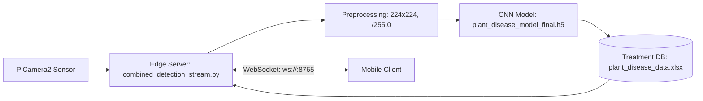

<div align="center">
  <h1>Farmer Eye</h1>
  <h3>Smart Vehicle for Crops Health Detection and Classification Using AI-powered and IoT</h3>

  <p>
    
  </p>

  <p>An edge-AI precision agriculture system combining mobile robotics, computer vision, and IoT to detect crop diseases in real time.</p>

  <p>
    <a href="https://github.com/mariiammaysara/FarmerEye/actions/workflows/tests.yml"></a>
    <a href="https://www.python.org/"></a>
    <a href="LICENSE"></a>
  </p>
</div>

---

## What It Does

- **Real-Time Edge Video**: Streams live camera images over WebSockets from a Raspberry Pi 4 to client devices.
- **Deep Learning Classification**: Evaluates crop leaves against 25 health categories across Cotton, Tomato, Potato, Pepper, and Strawberry.
- **Bilingual Actionable Advice**: Automatically matches diagnosed diseases with practical treatment instructions in English and Arabic.
- **Hardware-Free Testing**: Includes a mock test suite allowing development and verification on standard laptops without physical cameras or GPIO pins.

---

## System Architecture



---

## Quick Start

```bash
# 1. Clone the repository
git clone https://github.com/mariiammaysara/FarmerEye.git && cd FarmerEye

# 2. Create and activate a virtual environment
python -m venv venv && source venv/bin/activate  # Windows: venv\Scripts\Activate.ps1

# 3. Install testing dependencies
pip install -r requirements-dev.txt

# 4. Verify installation with automated tests
pytest -v

# 5. Launch edge streaming server (requires Raspberry Pi and camera)
python src/combined_detection_stream.py
```

---

## Results Snapshot

Evaluated on an independent holdout test set of 7,955 images:
- **Test Accuracy**: 97.95%
- **Macro Average F1-Score**: 0.98

*For complete 25-class precision, recall, confusion matrix heatmaps, and training curves, see [docs/model.md](docs/model.md).*

---

## Documentation

Full project guides and specifications are located in the [docs/](docs/README.md) directory:

| Guide | Description |
|---|---|
| [How It Works](docs/how-it-works.md) | Follows one camera image from capture to mobile treatment alert. |
| [Getting Started](docs/getting-started.md) | Setup, dependency installation, running scripts, and troubleshooting. |
| [System Architecture](docs/architecture.md) | Component layouts, data flow, server options, and threading models. |
| [Model and Training](docs/model.md) | Neural network structure, training parameters, and benchmark tables. |
| [WebSocket API](docs/websocket-api.md) | JSON message formats, client registration handshake, and event types. |
| [Treatment Database](docs/treatment-database.md) | Excel data schema, disease name normalization, and class addition steps. |
| [Hardware Setup](docs/hardware.md) | Camera module connection, physical boundaries, and testing limits. |
| [Development and Testing](docs/development.md) | Running pytest, hardware mocking architecture, CI, and code style. |
| [Limitations and Future Work](docs/limitations.md) | Technical boundaries, domain gap factors, and future roadmap. |
| [Glossary](docs/glossary.md) | Plain-English definitions of all machine learning and engineering terms. |

---

## Project Structure

```text
FarmerEye/
├── .github/workflows/tests.yml   # CI pipeline: Python 3.10 and pytest
├── data/
│   ├── plant_disease_data.xlsx   # Bilingual treatment database
│   └── README.md                 # Dataset provenance card and splits
├── docs/                         # Technical documentation and visual assets
├── models/
│   └── plant_disease_model_final.h5 # Trained Keras CNN model weights
├── notebooks/
│   └── research_and_training.ipynb  # Exploratory training notebook
├── src/                          # Inference, streaming, and conversion code
├── tests/                        # Hardware-mocked pytest suite
├── requirements.txt              # Raspberry Pi runtime dependencies
├── requirements-dev.txt          # Development and evaluation dependencies
├── LICENSE                       # MIT License
└── README.md                     # Project entry point
```

---

## Limitations

The model was trained primarily on laboratory leaf images with uniform backgrounds; performance under harsh outdoor sunlight or soil clutter may vary. WebSockets are unencrypted (`ws://`), and treatments are informational guidelines that require verification by an agronomist. See [docs/limitations.md](docs/limitations.md).

---

## Dataset and Citations

The training dataset incorporates images from the **PlantVillage** dataset:
- Hughes, D., & Salathé, M. (2015). *An open access repository of images on plant health to enable the development of mobile disease diagnostics*. [arXiv:1511.08060](https://arxiv.org/abs/1511.08060).
- Detailed dataset breakdown and splits: [data/README.md](data/README.md).

---

## License and Team

This project is licensed under the **MIT License** — see [LICENSE](LICENSE) for details.

### Developed and Designed by (FarmerEye Team)
- **Mariam Maysara**
- **Fatma Zayed**
- **Mohamed Magdy**
- **Mohamed Hesham**

*Faculty of Engineering — Graduation Project: Smart Vehicle for Crops Health Detection and Classification Using AI-powered and IoT.*
