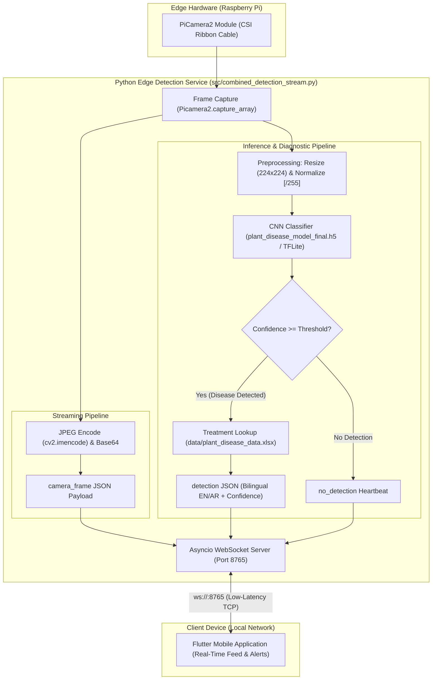

<div align="center">
  <h1> Farmer Eye Robotic Car – Graduation Project</h1>
  <h3>Smart Vehicle for Crops Health Detection and Classification Using AI-powered and IoT</h3>
  <p align="center">
    <a href="https://github.com/mariiammaysara/FarmerEye/actions/workflows/tests.yml">
      
    </a>
  </p>
  <p align="center">
    
  </p>
</div>

---

##  Project Overview

**Farmer Eye** (Registered Title: *Smart Vehicle for Crops Health Detection and Classification Using AI-powered and IoT*) is an end-to-end AI-IoT system designed to modernize agriculture by automating plant disease diagnostics. The system integrates a **remote-controlled robotic car**, high-performance **Deep Learning models**, and a **Raspberry Pi-powered edge device** to patrol fields and identify crop diseases in real-time.

By bridging the gap between hardware and software, Farmer Eye provides farmers with instant diagnostic feedback and localized treatment recommendations (available in English and Arabic) to prevent crop loss and optimize harvest health.

##  Mobile Application

The companion cross-platform mobile application built with **Flutter** is developed separately and is not included in this repository. It serves as the central hub for monitoring and control:

- 🎥 **Real-Time Live Feed**: Low-latency video streaming from the robotic car's onboard camera.
- 🔔 **Instant Alerts**: Real-time WebSocket detection messages sent the moment a plant disease is detected, including classification and confidence metrics.
- 💊 **Treatment Intelligence**: Integrated pharmaceutical database providing clinical diagnostics and treatment protocols.
- 🕹️ **Remote Telemetry**: Real-time status monitoring for hardware health and connectivity.

##  System Features

- **Real-Time Edge Inference**: Continuous monitoring and detection powered by localized processing on Raspberry Pi.
- **High-Accuracy CNN**: Fine-tuned Convolutional Neural Networks optimized for high-precision identification across various plant classes.
- **Multi-Crop Support**: Robust detection for Cotton, Tomato, Potato, Pepper, and Strawberry.
- **Bi-Lingual Diagnostics**: Comprehensive treatment guidance in both English and Arabic.
- **Modular Architecture**: Decoupled codebase designed for scalability and maintainability.
- **Local WebSocket Communication**: Asynchronous WebSocket communication ensuring low-latency data and video delivery between the edge device and connected clients on the local network.

##  System Architecture

The end-to-end dataflow strictly mirrors the active edge implementation ([src/combined_detection_stream.py](src/combined_detection_stream.py)):



##  Dataset

The plant disease detection model is trained on **39,776 validated images** across **25 classes** spanning 5 crops (Cotton, Tomato, Potato, Pepper, and Strawberry).

- **Sources**:
  - **PlantVillage Dataset**: Kaggle dataset ([KAGGLE_URL]), original repository [spMohanty/PlantVillage-Dataset](https://github.com/spMohanty/PlantVillage-Dataset), and reference paper ([Hughes & Salathé, 2015](https://arxiv.org/abs/1511.08060)).
  - **Additional Real-World Images** (Cotton & Field subsets): [DESCRIBE SOURCE + COUNT, or write "TBD"] — TBD.
- **Data Card**: Refer to the comprehensive [data/README.md](data/README.md) for full dataset specifications, split distributions (train 25,456 / val 6,365 / test 7,955), class lists, and download instructions.

##  Results

The evaluation metrics below were extracted directly from the executed research and training pipeline ([notebooks/research_and_training.ipynb](notebooks/research_and_training.ipynb)):

> [!NOTE]
> Metrics come from a random hold-out split of the dataset, measured on a workstation, not on the Raspberry Pi, and real-field performance was not evaluated.

* **Dataset source**: PlantVillage (Kaggle / GitHub) and additional real-world field images (Cotton & field subsets; source details TBD).
* **Dataset Partitioning (Two-Stage Stratified Split)**:
  * **Training Set**: 25,456 images (64.0%)
  * **Validation Set**: 6,365 images (16.0%)
  * **Test Holdout Set**: 7,955 images (20.0%)
  * **Total Validated**: 39,776 images (1 corrupted image discarded during verification)
* **Overall Test Set Evaluation (7,955 test images)**:
  * **Test Accuracy**: **97.95%** (`0.979510`)
  * **Test Loss**: **0.0787** (`0.078732`)
  * **Macro Average**: Precision = `0.97`, Recall = `0.98`, F1-Score = `0.98`
  * **Weighted Average**: Precision = `0.98`, Recall = `0.98`, F1-Score = `0.98`

### Per-Class Performance (Classification Report)

The following table reflects the exact classification report generated from the holdout test set (Cell 26):

| Class Index | Condition / Disease Name | Precision | Recall | F1-Score | Support |
|:---:|---|:---:|:---:|:---:|:---:|
| 0 | `Aphids_cotton` | 0.98 | 0.98 | 0.98 | 449 |
| 1 | `Army worm_cotton` | 0.98 | 0.99 | 0.98 | 448 |
| 2 | `Bacterial blight_cotton` | 0.95 | 0.95 | 0.95 | 529 |
| 3 | `Healthy_cotton` | 0.98 | 0.99 | 0.99 | 533 |
| 4 | `Pepper_bell__bacterial_spot` | 0.99 | 0.92 | 0.96 | 213 |
| 5 | `Pepper_bell__healthy` | 0.98 | 0.96 | 0.97 | 308 |
| 6 | `Potato___Early_blight` | 0.97 | 0.94 | 0.95 | 219 |
| 7 | `Potato___Late_blight` | 0.95 | 0.92 | 0.94 | 219 |
| 8 | `Potato___healthy` | 0.91 | 1.00 | 0.95 | 30 |
| 9 | `Powdery mildew_cotton` | 0.99 | 0.99 | 0.99 | 448 |
| 10 | `Strawberry___Leaf_scorch` | 1.00 | 1.00 | 1.00 | 222 |
| 11 | `Strawberry___healthy` | 0.99 | 1.00 | 0.99 | 91 |
| 12 | `Target spot_cotton` | 0.94 | 0.97 | 0.95 | 447 |
| 13 | `Tomato___Bacterial_spot` | 0.99 | 0.99 | 0.99 | 426 |
| 14 | `Tomato___Early_blight` | 0.98 | 0.94 | 0.96 | 200 |
| 15 | `Tomato___Late_blight` | 0.99 | 0.98 | 0.98 | 382 |
| 16 | `Tomato___Leaf_Mold` | 1.00 | 1.00 | 1.00 | 190 |
| 17 | `Tomato___Septoria_leaf_spot` | 0.99 | 1.00 | 0.99 | 355 |
| 18 | `Tomato___Spider_mites Two-spotted_spider_mite` | 0.97 | 0.99 | 0.98 | 335 |
| 19 | `Tomato___Target_Spot` | 0.98 | 0.97 | 0.98 | 281 |
| 20 | `Tomato___Tomato_Yellow_Leaf_Curl_Virus` | 1.00 | 1.00 | 1.00 | 1072 |
| 21 | `Tomato___Tomato_mosaic_virus` | 1.00 | 1.00 | 1.00 | 75 |
| 22 | `Tomato___healthy` | 1.00 | 1.00 | 1.00 | 318 |
| 23 | `cotton_curl_virus` | 0.90 | 0.99 | 0.94 | 82 |
| 24 | `cotton_fussarium_wilt` | 0.94 | 1.00 | 0.97 | 83 |
| — | **Accuracy** | — | — | **0.98** | **7,955** |
| — | **Macro Average** | **0.97** | **0.98** | **0.98** | **7,955** |
| — | **Weighted Average** | **0.98** | **0.98** | **0.98** | **7,955** |

### Training History & Confusion Matrix

<div align="center">
  <p><b>Training & Validation Accuracy / Loss Curves (50 Epochs)</b></p>
  
  <br><br>
  <p><b>Test Set Confusion Matrix</b></p>
  
</div>

> [!WARNING]
> **Known Issue**: The notebook's fine-tuning cell did not execute (`initial_epoch >= epochs` because `epochs_finetune=10` was less than `history.epoch[-1]=49`). The reported fine-tuned metrics are therefore identical to the initial 50-epoch trained model.

##  Tech Stack

###  Artificial Intelligence & Data
- **Frameworks**: TensorFlow, Keras, Scikit-learn
- **Libraries**: NumPy, Pandas, OpenCV, PIL (Pillow)
- **Deep Learning**: Convolutional Neural Networks (CNN)

###  Hardware & IoT
- **Compute**: Raspberry Pi
- **Camera**: PiCamera2 / HD Modules
- **Mechanics**: Robotic Car Chassis, L298N Motor Drivers
- **Connectivity**: WebSockets (Asyncio)

###  Mobile & Frontend
- **Framework**: Flutter (Dart)
- **Communication**: WebSocket Client

###  Backend & Infrastructure
- **Server**: Python-based WebSocket Server
- **Database**: Excel/CSV-based treatment reference (Openpyxl)

##  Project Structure

```text
FarmerEye/
├── data/
│   ├── plant_disease_data.xlsx      # Database for treatments and diagnostics
│   └── README.md                    # Dataset card and documentation
├── docs/
│   └── assets/
│       ├── results/                 # Extracted training curves and confusion matrix
│       └── robotic_car_image.jpg    # Project visual assets
├── models/
│   ├── fine_tuned_model.h5          # Optimized CNN model
│   └── plant_disease_model_final.h5 # Final trained model
├── notebooks/
│   └── research_and_training.ipynb  # ML development and training pipeline
├── src/
│   ├── app.py                       # Training script ported from research notebook
│   ├── class_names.py               # Single source of truth for 25 classes and normalization
│   ├── combined_detection_stream.py # Combined camera streaming, detection, and WebSocket service
│   ├── convert_tflite.py            # Model conversion utility (float16/dynamic quantization)
│   ├── evaluate.py                  # Offline evaluation script (.h5 and .tflite metrics)
│   ├── raspberry_pi_camera_stream.py# Standalone camera streaming service
│   └── real_time_detection.py       # Detection service with thresholding and treatments
├── tests/                           # Hardware-mocked pytest test suite (27+ tests)
├── requirements.txt                 # Runtime dependencies (Raspberry Pi)
├── requirements-dev.txt             # Development, training, and testing dependencies
└── README.md                        # Project documentation
```

##  Installation

1. **Clone the Repository**
   ```bash
   git clone https://github.com/mariiammaysara/FarmerEye.git
   cd FarmerEye
   ```

2. **Environment Setup**
   ```bash
   python -m venv venv
   source venv/bin/activate  # Windows: venv\Scripts\activate
   ```

3. **Install Dependencies**
   - **For Runtime (Raspberry Pi edge inference & streaming)**:
     ```bash
     pip install -r requirements.txt
     ```
   - **For Development & Training (notebook, evaluation, testing)**:
     ```bash
     pip install -r requirements-dev.txt
     ```

##  Hardware Setup & Wiring / Pinout

### 1. Camera Configuration
- Connect the Raspberry Pi Camera Module to the **CSI (Camera Serial Interface)** port using a 15-pin ribbon cable.
- Enable the camera interface on Raspberry Pi (`sudo raspi-config` -> *Interface Options* -> *Camera* -> *Enable*).
- Install `Picamera2` using the system package manager on Raspberry Pi OS (do **not** install via `pip`):
  ```bash
  sudo apt update && sudo apt install -y python3-picamera2
  ```

### 2. Wiring & Pinout Table

The table below documents every physical pin and interface used across the edge vehicle setup.

> [!IMPORTANT]
> **GPIO Implementation Notice**: The active codebase in `src/` implements video streaming, AI disease inference, and WebSocket communication, but **does not contain motor driver GPIO control code**. The pin assignments below reflect the project's standard 4-pin L298N H-Bridge mapping defined and tested in [tests/test_motor.py](tests/test_motor.py). Pin connections marked **verify on hardware** must be verified on the physical chassis before running any motor scripts.

| Interface / Header | BCM GPIO | Physical Pin | Target Component & Pin | Functional Role | Source File & Line | Status |
|---|:---:|:---:|---|---|---|:---:|
| **CSI Port** | — | 15-pin Ribbon | PiCamera2 / CSI Camera | Video capture stream | [src/combined_detection_stream.py:13](src/combined_detection_stream.py#L13) | **Confirmed in code** |
| **GPIO Header** | `GPIO 17` | Pin 11 | L298N `IN1` | Left Motor Forward | [tests/test_motor.py:12](tests/test_motor.py#L12) | *Verify on hardware (no GPIO code in src/)* |
| **GPIO Header** | `GPIO 27` | Pin 13 | L298N `IN2` | Left Motor Backward | [tests/test_motor.py:13](tests/test_motor.py#L13) | *Verify on hardware (no GPIO code in src/)* |
| **GPIO Header** | `GPIO 22` | Pin 15 | L298N `IN3` | Right Motor Forward | [tests/test_motor.py:14](tests/test_motor.py#L14) | *Verify on hardware (no GPIO code in src/)* |
| **GPIO Header** | `GPIO 23` | Pin 16 | L298N `IN4` | Right Motor Backward | [tests/test_motor.py:15](tests/test_motor.py#L15) | *Verify on hardware (no GPIO code in src/)* |
| **Power Header** | `5V` | Pin 2 or 4 | L298N `5V Logic` | Logic Power supply for driver | — | *Verify on hardware* |
| **Ground Header** | `GND` | Pin 6 (or any GND) | L298N `GND` | Common ground reference | — | *Verify on hardware* |
| **Chassis Battery** | — | External Terminal | L298N `12V / VCC` | Motor driving power (7V–12V DC) | — | *Verify on hardware* |

### 3. Power Management
- Ensure a stable 5V / 3A power supply (e.g. dedicated power bank or buck converter) for the Raspberry Pi.
- Power the L298N motor driver from an independent chassis battery pack (e.g. 2x 18650 Li-ion cells in series for ~7.4V–8.4V), with common grounds (GND) tied to the Raspberry Pi.

##  Usage

### 1. Training & Research
Explore the model development phase via Jupyter:
```bash
jupyter notebook notebooks/
```

### 2. Real-Time Detection
Start the monitoring system on the Raspberry Pi:
```bash
python src/real_time_detection.py
```

### 3. Unified Stream Analysis
Run the combined detection and streaming service:
```bash
python src/combined_detection_stream.py
```

### 4. Offline Model Evaluation
Evaluate a trained model against an unseen test dataset organized in class subfolders:
```bash
python src/evaluate.py --model models/plant_disease_model_final.h5 --data path/to/test_dataset
```
*(Also supports `--model-path`, `--data-dir`, `--output-dir`, and `--batch-size`)*.

This script computes inference metrics and outputs `metrics.json` (overall accuracy, macro/weighted averages, and per-class precision/recall/F1), `confusion_matrix.png`, and `classification_report.txt` to `docs/assets/results/` (or a custom `--output-dir`).

##  Output
Upon detection, the system provides:
- **Disease Classification**: Accurate identification of the plant condition.
- **Confidence Score**: Statistical probability of the detection.
- **Treatment Protocol**: Actionable advice in English/Arabic fetched from the database.

##  Limitations & Future Work

While Farmer Eye establishes a functional edge-AI diagnostic prototype, several technical constraints define the scope of the current release and outline priorities for future development:

1. **Limited Crop and Condition Scope**:
   The classification model is restricted to **25 classes across 5 crops** (Cotton, Tomato, Potato, Pepper, and Strawberry). Many common regional crops, weed species, and nutrient deficiencies fall outside the current label set.
   * *Future Work*: Broaden the taxonomy to include cereal grains (Wheat, Corn, Rice), legumes, and non-pathogenic abiotic stressors (drought, nitrogen deficiency).

2. **Dataset Domain Gap (Controlled vs. Real Field Conditions)**:
   A significant proportion of the training data originates from the PlantVillage benchmark ([Hughes & Salathé, 2015](https://arxiv.org/abs/1511.08060)), where leaves were captured excised in controlled laboratory setups against uniform monochrome backgrounds. Real agricultural environments introduce dynamic daylight, harsh shadows, complex background foliage, and camera motion blur.
   * *Future Work*: Collect, annotate, and fine-tune on in-situ field imagery with complex backgrounds, utilizing domain adaptation techniques and self-supervised pretraining.

3. **Unencrypted Local WebSocket Communication**:
   The current edge streaming server relies on standard, unencrypted WebSockets (`ws://`) without cryptographic TLS certificates or token-based authentication.
   * *Future Work*: Upgrade to secure WebSockets (`wss://`) utilizing TLS encryption and API key or JWT-based mutual authentication to safeguard vehicle control and data integrity.

4. **Manual Teleoperation (Absence of Autonomous Navigation)**:
   Vehicle movement currently depends on manual driving commands sent from the mobile interface.
   * *Future Work*: Integrate autonomous patrol capabilities, including GPS/RTK waypoint tracking, ultrasonic/LiDAR obstacle avoidance, and visual SLAM for structured furrow navigation.

5. **Spreadsheet-Based Diagnostic Database**:
   Treatments are queried from a local Excel workbook (`data/plant_disease_data.xlsx`), which lacks concurrent write capabilities, caching, and automated remote synchronizability.
   * *Future Work*: Migrate to an embedded relational database (e.g., SQLite or PostgreSQL) with REST/GraphQL synchronization for real-time agronomic catalog updates.

6. **Advisory Nature of Recommendations**:
   > [!CAUTION]
   > All treatment recommendations provided by the system are strictly informational and advisory. Real-world pesticide, fungicide, and cultural treatments must be reviewed, confirmed, and supervised by a qualified agronomist or local agricultural extension specialist before field application.

##  License

This project is licensed under the MIT License — see the [LICENSE](LICENSE) file for details.

---

<p align="center">
  <b>Developed and Designed by</b><br>
  Mariam Maysara • Fatma Zayed • Mohamed Magdy • Mohamed Hesham
  <br><br>
  <b>FarmerEye Team</b>
</p>
