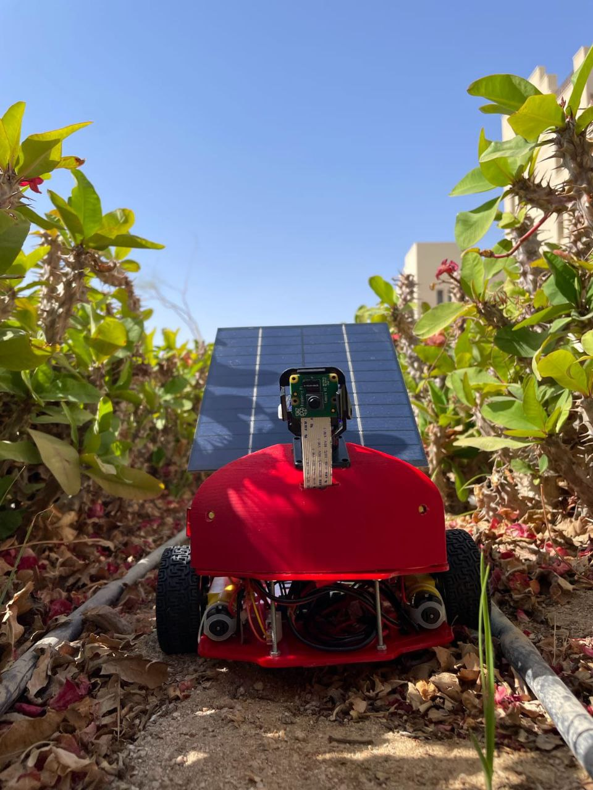
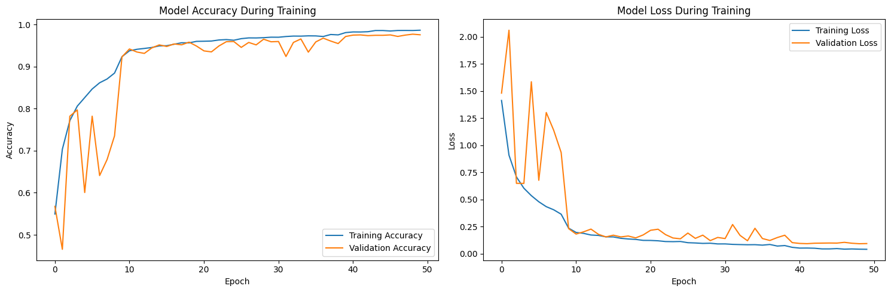
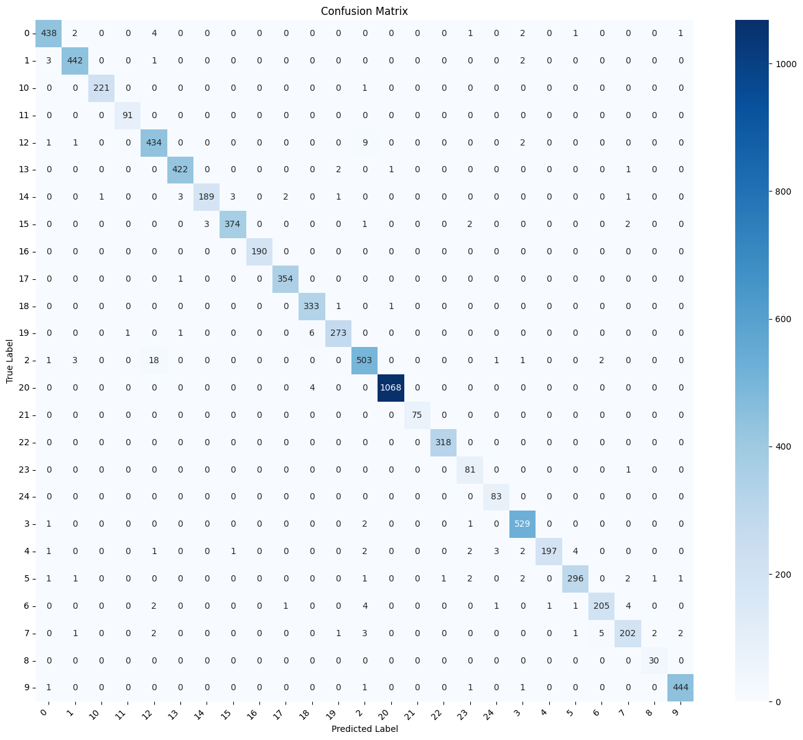

<div align="center">
  <h1> Farmer Eye Robotic Car – Graduation Project</h1>
  <h3>Smart Vehicle for Crops Health Detection and Classification Using AI-powered and IoT</h3>
  <p align="center">
    <a href="https://github.com/mariiammaysara/FarmerEye/actions/workflows/tests.yml">
      
    </a>
  </p>
  <p align="center">
    
  </p>
</div>

---

##  Project Overview

**Farmer Eye** (Registered Title: *Smart Vehicle for Crops Health Detection and Classification Using AI-powered and IoT*) is an end-to-end AI-IoT system designed to modernize agriculture by automating plant disease diagnostics. The system integrates a **remote-controlled robotic car**, high-performance **Deep Learning models**, and a **Raspberry Pi-powered edge device** to patrol fields and identify crop diseases in real-time.

By bridging the gap between hardware and software, Farmer Eye provides farmers with instant diagnostic feedback and localized treatment recommendations (available in English and Arabic) to prevent crop loss and optimize harvest health.

##  Mobile Application

The companion cross-platform mobile application built with **Flutter** is developed separately and is not included in this repository. It serves as the central hub for monitoring and control:

- 🎥 **Real-Time Live Feed**: Low-latency video streaming from the robotic car's onboard camera.
- 🔔 **Instant Alerts**: Real-time WebSocket detection messages sent the moment a plant disease is detected, including classification and confidence metrics.
- 💊 **Treatment Intelligence**: Integrated pharmaceutical database providing clinical diagnostics and treatment protocols.
- 🕹️ **Remote Telemetry**: Real-time status monitoring for hardware health and connectivity.

##  System Features

- **Real-Time Edge Inference**: Continuous monitoring and detection powered by localized processing on Raspberry Pi.
- **High-Accuracy CNN**: Fine-tuned Convolutional Neural Networks optimized for high-precision identification across various plant classes.
- **Multi-Crop Support**: Robust detection for Cotton, Tomato, Potato, Pepper, and Strawberry.
- **Bi-Lingual Diagnostics**: Comprehensive treatment guidance in both English and Arabic.
- **Modular Architecture**: Decoupled codebase designed for scalability and maintainability.
- **Local WebSocket Communication**: Asynchronous WebSocket communication ensuring low-latency data and video delivery between the edge device and connected clients on the local network.

##  Dataset

The plant disease detection model is trained on **39,776 validated images** across **25 classes** spanning 5 crops (Cotton, Tomato, Potato, Pepper, and Strawberry).

- **Sources**:
  - **PlantVillage Dataset**: Kaggle dataset ([KAGGLE_URL]), original repository [spMohanty/PlantVillage-Dataset](https://github.com/spMohanty/PlantVillage-Dataset), and reference paper ([Hughes & Salathé, 2015](https://arxiv.org/abs/1511.08060)).
  - **Additional Real-World Images** (Cotton & Field subsets): [DESCRIBE SOURCE + COUNT, or write "TBD"] — TBD.
- **Data Card**: Refer to the comprehensive [data/README.md](data/README.md) for full dataset specifications, split distributions (train 25,456 / val 6,365 / test 7,955), class lists, and download instructions.

##  Results

The evaluation metrics below were extracted directly from the executed research and training pipeline ([notebooks/research_and_training.ipynb](notebooks/research_and_training.ipynb)):

> [!NOTE]
> Metrics come from a random hold-out split of the dataset, measured on a workstation, not on the Raspberry Pi, and real-field performance was not evaluated.

* **Dataset source**: PlantVillage (Kaggle / GitHub) and additional real-world field images (Cotton & field subsets; source details TBD).
* **Dataset Partitioning (Two-Stage Stratified Split)**:
  * **Training Set**: 25,456 images (64.0%)
  * **Validation Set**: 6,365 images (16.0%)
  * **Test Holdout Set**: 7,955 images (20.0%)
  * **Total Validated**: 39,776 images (1 corrupted image discarded during verification)
* **Overall Test Set Evaluation (7,955 test images)**:
  * **Test Accuracy**: **97.95%** (`0.979510`)
  * **Test Loss**: **0.0787** (`0.078732`)
  * **Macro Average**: Precision = `0.97`, Recall = `0.98`, F1-Score = `0.98`
  * **Weighted Average**: Precision = `0.98`, Recall = `0.98`, F1-Score = `0.98`

### Per-Class Performance (Classification Report)

The following table reflects the exact classification report generated from the holdout test set (Cell 26):

| Class Index | Condition / Disease Name | Precision | Recall | F1-Score | Support |
|:---:|---|:---:|:---:|:---:|:---:|
| 0 | `Aphids_cotton` | 0.98 | 0.98 | 0.98 | 449 |
| 1 | `Army worm_cotton` | 0.98 | 0.99 | 0.98 | 448 |
| 2 | `Bacterial blight_cotton` | 0.95 | 0.95 | 0.95 | 529 |
| 3 | `Healthy_cotton` | 0.98 | 0.99 | 0.99 | 533 |
| 4 | `Pepper_bell__bacterial_spot` | 0.99 | 0.92 | 0.96 | 213 |
| 5 | `Pepper_bell__healthy` | 0.98 | 0.96 | 0.97 | 308 |
| 6 | `Potato___Early_blight` | 0.97 | 0.94 | 0.95 | 219 |
| 7 | `Potato___Late_blight` | 0.95 | 0.92 | 0.94 | 219 |
| 8 | `Potato___healthy` | 0.91 | 1.00 | 0.95 | 30 |
| 9 | `Powdery mildew_cotton` | 0.99 | 0.99 | 0.99 | 448 |
| 10 | `Strawberry___Leaf_scorch` | 1.00 | 1.00 | 1.00 | 222 |
| 11 | `Strawberry___healthy` | 0.99 | 1.00 | 0.99 | 91 |
| 12 | `Target spot_cotton` | 0.94 | 0.97 | 0.95 | 447 |
| 13 | `Tomato___Bacterial_spot` | 0.99 | 0.99 | 0.99 | 426 |
| 14 | `Tomato___Early_blight` | 0.98 | 0.94 | 0.96 | 200 |
| 15 | `Tomato___Late_blight` | 0.99 | 0.98 | 0.98 | 382 |
| 16 | `Tomato___Leaf_Mold` | 1.00 | 1.00 | 1.00 | 190 |
| 17 | `Tomato___Septoria_leaf_spot` | 0.99 | 1.00 | 0.99 | 355 |
| 18 | `Tomato___Spider_mites Two-spotted_spider_mite` | 0.97 | 0.99 | 0.98 | 335 |
| 19 | `Tomato___Target_Spot` | 0.98 | 0.97 | 0.98 | 281 |
| 20 | `Tomato___Tomato_Yellow_Leaf_Curl_Virus` | 1.00 | 1.00 | 1.00 | 1072 |
| 21 | `Tomato___Tomato_mosaic_virus` | 1.00 | 1.00 | 1.00 | 75 |
| 22 | `Tomato___healthy` | 1.00 | 1.00 | 1.00 | 318 |
| 23 | `cotton_curl_virus` | 0.90 | 0.99 | 0.94 | 82 |
| 24 | `cotton_fussarium_wilt` | 0.94 | 1.00 | 0.97 | 83 |
| — | **Accuracy** | — | — | **0.98** | **7,955** |
| — | **Macro Average** | **0.97** | **0.98** | **0.98** | **7,955** |
| — | **Weighted Average** | **0.98** | **0.98** | **0.98** | **7,955** |

### Training History & Confusion Matrix

<div align="center">
  <p><b>Training & Validation Accuracy / Loss Curves (50 Epochs)</b></p>
  
  <br><br>
  <p><b>Test Set Confusion Matrix</b></p>
  
</div>

> [!WARNING]
> **Known Issue**: The notebook's fine-tuning cell did not execute (`initial_epoch >= epochs` because `epochs_finetune=10` was less than `history.epoch[-1]=49`). The reported fine-tuned metrics are therefore identical to the initial 50-epoch trained model.

##  Tech Stack

###  Artificial Intelligence & Data
- **Frameworks**: TensorFlow, Keras, Scikit-learn
- **Libraries**: NumPy, Pandas, OpenCV, PIL (Pillow)
- **Deep Learning**: Convolutional Neural Networks (CNN)

###  Hardware & IoT
- **Compute**: Raspberry Pi
- **Camera**: PiCamera2 / HD Modules
- **Mechanics**: Robotic Car Chassis, L298N Motor Drivers
- **Connectivity**: WebSockets (Asyncio)

###  Mobile & Frontend
- **Framework**: Flutter (Dart)
- **Communication**: WebSocket Client

###  Backend & Infrastructure
- **Server**: Python-based WebSocket Server
- **Database**: Excel/CSV-based treatment reference (Openpyxl)

##  Project Structure

```text
FarmerEye/
├── data/
│   ├── plant_disease_data.xlsx      # Database for treatments and diagnostics
│   └── README.md                    # Dataset card and documentation
├── docs/
│   └── assets/
│       ├── results/                 # Extracted training curves and confusion matrix
│       └── robotic_car_image.jpg    # Project visual assets
├── models/
│   ├── fine_tuned_model.h5          # Optimized CNN model
│   └── plant_disease_model_final.h5 # Final trained model
├── notebooks/
│   └── research_and_training.ipynb  # ML development and training pipeline
├── src/
│   ├── app.py                       # Main application entry point
│   ├── class_names.py               # Single source of truth for classes and normalization
│   ├── combined_detection_stream.py # Combined UI and streaming logic
│   ├── real_time_detection.py       # Core inference and hardware logic
│   └── raspberry_pi_camera_stream.py# Low-level camera streaming service
├── tests/                           # System validation and testing (planned)
├── requirements.txt                 # Runtime dependencies (Raspberry Pi)
├── requirements-dev.txt             # Development, training, and testing dependencies
└── README.md                        # Project documentation
```

##  Installation

1. **Clone the Repository**
   ```bash
   git clone https://github.com/mariiammaysara/FarmerEye.git
   cd FarmerEye
   ```

2. **Environment Setup**
   ```bash
   python -m venv venv
   source venv/bin/activate  # Windows: venv\Scripts\activate
   ```

3. **Install Dependencies**
   - **For Runtime (Raspberry Pi edge inference & streaming)**:
     ```bash
     pip install -r requirements.txt
     ```
   - **For Development & Training (notebook, evaluation, testing)**:
     ```bash
     pip install -r requirements-dev.txt
     ```

##  Hardware Setup

1. **Camera Configuration**:
   - Enable the camera interface on Raspberry Pi (`raspi-config`).
   - Install `Picamera2` using the system package manager on Raspberry Pi OS (do **not** install via `pip`):
     ```bash
     sudo apt update && sudo apt install -y python3-picamera2
     ```
2. **Motor Driver**:
   - Connect the motor driver to the GPIO pins as configured in the source code.
3. **Power Management**:
   - Ensure stable power supply for both the Raspberry Pi and the motor chassis.

##  Usage

### 1. Training & Research
Explore the model development phase via Jupyter:
```bash
jupyter notebook notebooks/
```

### 2. Real-Time Detection
Start the monitoring system on the Raspberry Pi:
```bash
python src/real_time_detection.py
```

### 3. Unified Stream Analysis
Run the combined detection and streaming service:
```bash
python src/combined_detection_stream.py
```

##  Output
Upon detection, the system provides:
- **Disease Classification**: Accurate identification of the plant condition.
- **Confidence Score**: Statistical probability of the detection.
- **Treatment Protocol**: Actionable advice in English/Arabic fetched from the database.
---

<p align="center">
  <b>Developed and Designed by</b><br>
  Mariam Maysara • Fatma Zayed • Mohamed Magdy • Mohamed Hesham
  <br><br>
  <b>FarmerEye Team</b>
</p>
