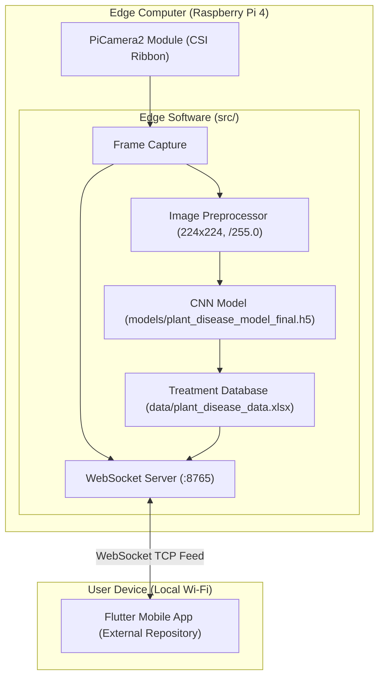

# System Architecture

What this page covers:
This page describes the software design and runtime architecture of Farmer Eye.
It details the data flow between modules, explains the differences between the two edge servers, and outlines the threading and concurrency model.

---

## High-Level Overview

Farmer Eye operates as an edge system where video capture, AI evaluation, and communication occur on a local single-board computer (Raspberry Pi 4).
The system connects to a client application over a local Wi-Fi network using WebSockets.

---

## System Components

1. **Camera Input**: Captures raw image arrays directly from the Raspberry Pi Camera Module using `picamera2`.
2. **Preprocessing Pipeline**: Converts image arrays to RGB, scales dimensions to 224x224 pixels, and normalizes pixel values to the range [0.0, 1.0].
3. **Inference Engine**: Executes a 5-block convolutional neural network to predict plant diseases. Runs in TensorFlow/Keras or TensorFlow Lite.
4. **Advisory Database**: Reads localized disease records and treatments from `data/plant_disease_data.xlsx` via Pandas.
5. **WebSocket Gateway**: Manages client connections, broadcasts video frames, and sends disease alerts.
6. **Mobile App (External)**: An external Flutter application that receives the video feed and displays diagnostic notifications. *Note: The mobile application source code is not included in this repository.*
7. **Chassis & Motors**: *Note: Physical motor control code is not included in this repository. Only hardware pin constants and unit test stubs are present.*

---

## Comparison of the Two Edge Servers

The repository contains two operational server implementations located in `src/`.
They serve different integration needs:

| Feature / Detail | `combined_detection_stream.py` | `real_time_detection.py` |
|---|---|---|
| **Primary Role** | Unified single-port server for streaming and diagnostics. | Legacy multi-server implementation with separate control port. |
| **Network Ports** | Port `8765` only (combined video, detection, and registration). | Port `8765` (video stream) and Port `8766` (motor control). |
| **Concurrency Model** | Single Python process using `asyncio` event loop. | Multi-threaded design combining Python `threading` and `asyncio`. |
| **Client Registration** | Requires explicit handshake message within 10 seconds. | Accepts all connections immediately without a handshake message. |
| **Plant Detection Filter** | Time-based cooldown timer (checks inference every 2.0s). | Computer vision filter (checks HSV green contour area >= 1,000 px). |
| **Confidence Threshold** | 0.98 (98% minimum confidence). | 0.70 (70% minimum confidence). |
| **When to Use** | Recommended for modern mobile applications needing a single network connection. | Used for older tests or setups requiring separate network channels for driving and video. |

---

## Concurrency and Threading Architecture

### Model 1: Asynchronous Event Loop (`combined_detection_stream.py`)
In `combined_detection_stream.py`, all network communication and frame processing run inside a single Python `asyncio` event loop:

- **Non-Blocking Network I/O**: Connections, disconnections, and message broadcasting are handled with `async` and `await` calls.
- **Client Heartbeat Tasks**: A background task periodically checks whether connected clients have responded to WebSocket pings within 10 seconds.
- **Main Loop**: The script runs `detection_stream_loop()`, which repeatedly captures frames, sends JPEG messages, and evaluates disease conditions when the cooldown timer expires.

### Model 2: Multi-Threaded Architecture (`real_time_detection.py`)
In `real_time_detection.py`, tasks are split between operating system threads:

- **Camera Thread**: Captures frames from the camera hardware in a dedicated loop, applies the HSV green mask, and stores the latest frame in a shared variable.
- **WebSocket Video Server**: Runs on port 8765 to broadcast video frames to connected viewers.
- **WebSocket Control Server**: Runs on port 8766 to listen for vehicle driving commands.
- **Synchronization**: Threads use Python threading locks (`threading.Lock`) to prevent race conditions when reading and writing the active image frame.

---

## Next Steps

- Follow the journey of a single frame in [How It Works](how-it-works.md).
- Learn how to start these servers in [Getting Started](getting-started.md).
- Review all message types and ports in [WebSocket API](websocket-api.md).
