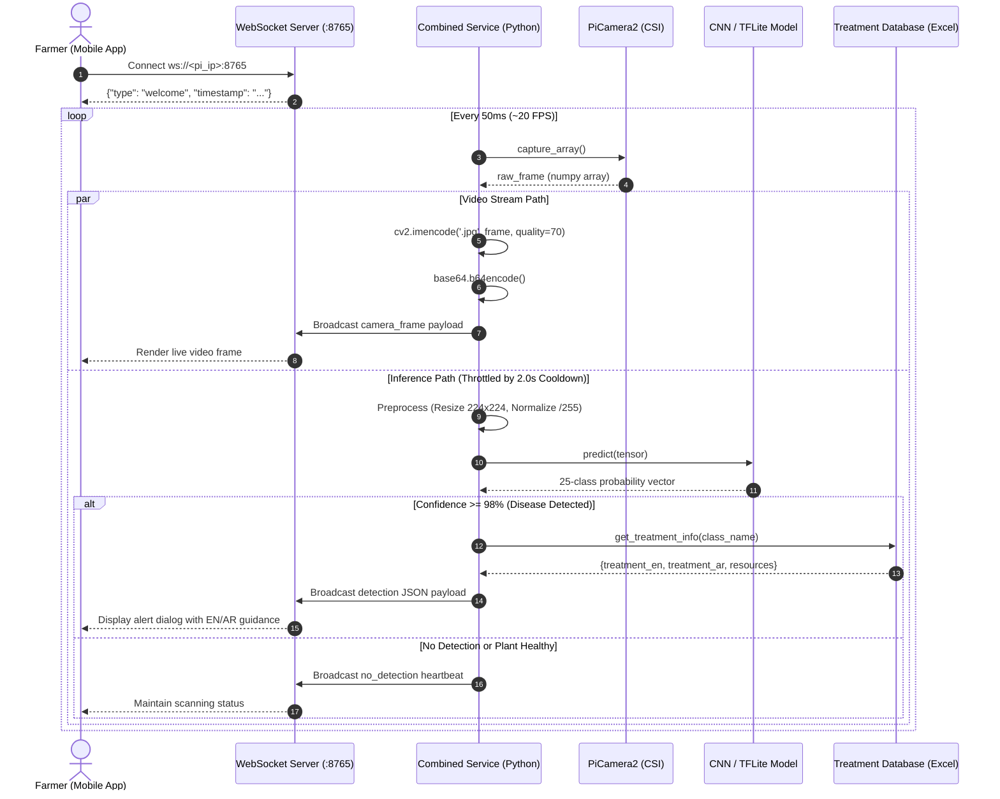

# System Architecture & Technical Design

This document details the software architecture, edge computing dataflow, and concurrency model of the **Farmer Eye** plant health diagnostic system.

---

## 1. High-Level System Overview

Farmer Eye bridges edge Internet of Things (IoT) hardware with modern Deep Learning computer vision. The system is designed to execute locally on a **Raspberry Pi** deployed on a mobile robotic vehicle patrolling agricultural rows.

```
 [ Field Environment ]
          │
          ▼
   [ PiCamera2 (CSI) ]
          │
          ▼
┌────────────────────────────────────────────────────────┐
│               Raspberry Pi Edge Device                 │
│                                                        │
│   ┌─────────────────────┐    ┌─────────────────────┐   │
│   │   Video Streaming   │    │  Inference Pipeline │   │
│   │   (JPEG / Base64)   │    │   (CNN / TFLite)    │   │
│   └──────────┬──────────┘    └──────────┬──────────┘   │
│              │                          │              │
│              │                          ▼              │
│              │               ┌─────────────────────┐   │
│              │               │  Treatment Lookup   │   │
│              │               │ (Bilingual Database)│   │
│              │               └──────────┬──────────┘   │
│              │                          │              │
│              ▼                          ▼              │
│     ┌──────────────────────────────────────────────┐   │
│     │        Asyncio WebSocket Server (:8765)      │   │
│     └──────────────────────┬───────────────────────┘   │
└────────────────────────────┼───────────────────────────┘
                             │
                             ▼  Local Wi-Fi Network
                  ┌─────────────────────┐
                  │ Flutter Mobile App  │
                  │  (Operator Screen)  │
                  └─────────────────────┘
```

The system operates fully offline on the local area network (LAN), meaning **no external cloud connectivity or internet access is required** for active field diagnostics.

---

## 2. Component Breakdown

The architecture is divided into four decoupled subsystems:

### A. Hardware & Video Ingestion
- **Camera Interface**: Captures frames via the Raspberry Pi Camera Serial Interface (CSI) using the modern `libcamera`-backed `Picamera2` driver.
- **Resolution & Frame Rate**: Optimized at **640x480 pixels** at **20 FPS**, balancing edge thermal constraints with fine leaf visual details.

### B. Core Edge Application (`src/combined_detection_stream.py`)
- **Dual-Pipeline Execution**: Separates high-frequency video streaming from compute-intensive deep learning inference so video remains fluid even during model execution.
- **Image Preprocessing**: Resizes incoming image crops to `224x224`, normalizes pixel intensities from `[0, 255]` to `[0.0, 1.0]`, and expands dimensions to a 4D batch tensor `(1, 224, 224, 3)`.
- **Classification Engine**: Executes inference using either the trained Keras model (`plant_disease_model_final.h5`) or an optimized quantized TensorFlow Lite model (`plant_disease_model_float16.tflite`).
- **Tolerant Treatment Lookup**: When disease confidence meets or exceeds the threshold (`DETECTION_THRESHOLD = 0.98`), the system queries `data/plant_disease_data.xlsx` using normalized naming matching to retrieve both English and Arabic treatment protocols.

### C. Communication Server (Asyncio WebSockets)
- **Transport**: Persistent, bidirectional WebSocket connection on port `8765`.
- **Payload Format**: Standardized JSON packets containing timestamps, status flags, base64-encoded imagery, and diagnostic details.
- **Heartbeat & Liveness**: Server enforces 20-second ping intervals and 35-second timeouts to prune disconnected mobile clients without service interruptions.

### D. Mobile Client (Flutter UI)
- Connects directly to the robotic car's IP address: `ws://<pi-ip>:8765`.
- Decodes and displays the continuous camera feed.
- Renders real-time diagnostic alerts, showing disease confidence scores and bilingual treatment guidelines.

---

## 3. End-to-End Sequence Diagram

The following sequence illustrates how a single frame flows through the edge detection service:



---

## 4. Concurrency & Performance Design

Running deep learning models on resource-constrained microcomputers (such as the Raspberry Pi 4) requires careful concurrency management to avoid UI lag and video stutter:

1. **Non-Blocking Asynchronous Loop**:
   Built on Python's native `asyncio` and `websockets` library. Network transmission never blocks frame capture or inference.
2. **Detection Cooldown (`DETECTION_COOLDOWN = 2.0s`)**:
   Inference is throttled to run at maximum once every 2 seconds. This prevents thermal throttling on the Raspberry Pi's Quad-core ARM Cortex-A72 CPU while maintaining sufficient diagnostic frequency for a slow-moving agricultural vehicle.
3. **JPEG Compression Tuning (`STREAM_QUALITY = 70`)**:
   Balancing visual clarity against local network bandwidth, 70% quality reduces frame size by over **75%** compared to uncompressed streaming, preserving smooth framerates over agricultural Wi-Fi networks.
4. **Hardware Portability & Fallbacks**:
   Hardware dependencies (`picamera2`, `RPi.GPIO`) and large frameworks (`tensorflow`) are wrapped with graceful import guards and mock stubs, enabling desktop development, continuous integration testing, and edge execution from a single unified codebase.
