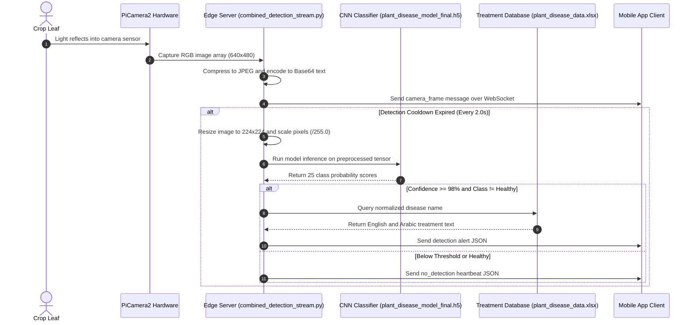

# How It Works

What this page covers:
This page explains how the Farmer Eye system inspects crops in real time.
It follows one single camera frame from physical capture to disease classification and treatment transmission.

---

## Key Ideas

Before following the frame, review the basic concepts used in this process:

- **Frame**: A single still image taken from a continuous video camera feed.
- **Base64**: A text format used to convert binary data (such as image bytes) into plain text so network systems can send it easily.
- **WebSocket**: A two-way network connection that stays open between a client and server for instant message exchange.
- **CNN (Convolutional Neural Network)**: A deep learning model designed to analyze images by passing small mathematical filters over pixels to find visual patterns.
- **Softmax**: A mathematical formula applied at the end of a neural network that converts raw scores into probabilities that sum to 100%.
- **Confidence Threshold**: A minimum score required before the system trusts a model prediction and takes action.
- **HSV Mask**: A color filter based on Hue, Saturation, and Value used to find specific colors (such as green plant leaves) in an image.

---

## The Journey of One Camera Frame

The diagram below shows what happens to a single image frame as it moves through the edge detection service:

---

## Step-by-Step Breakdown

### Step 1: Physical Capture
The camera hardware captures a picture of a leaf.
On the Raspberry Pi, the script uses the `picamera2` library to request an image directly from the camera sensor via a ribbon cable.
The frame enters the script as a NumPy array of size 640 pixels wide by 480 pixels high, with 3 color channels (Red, Green, and Blue).
See: [`../src/combined_detection_stream.py`](../src/combined_detection_stream.py).

### Step 2: Compression and Streaming
To display the video on the mobile phone, the server compresses the raw frame into a standard JPEG image using OpenCV (`cv2.imencode`).
Compressing the frame reduces its file size so it transfers quickly over local Wi-Fi without causing network lag.
The script converts the JPEG bytes into a Base64 text string.
The server wraps this text into a JSON message with the type `camera_frame` and sends it to all connected mobile clients.
See: [`../src/combined_detection_stream.py`](../src/combined_detection_stream.py).

### Step 3: Plant Detection Filter
Running deep learning models takes processing power and generates heat on small computers.
The system uses filters to prevent running the heavy neural network on empty air or non-plant objects:
- In [`../src/real_time_detection.py`](../src/real_time_detection.py), the code creates an HSV color mask to find green pixels. It calculates the contour area and only triggers the model if green pixels cover at least 1,000 square pixels.
- In [`../src/combined_detection_stream.py`](../src/combined_detection_stream.py), the script enforces a 2.0-second cooldown timer between diagnostic checks so the processor has time to maintain a smooth 20 FPS video stream.

### Step 4: Image Preprocessing
Before feeding an image to the neural network, the image must match the exact format used during training:
1. **Resize**: The image is scaled down to 224 pixels by 224 pixels (`cv2.resize`).
2. **Type Conversion**: The integers (0 to 255) are converted to 32-bit floating-point numbers (`np.float32`).
3. **Normalization**: Pixel values are divided by 255.0 so all numbers fall into the range between 0.0 and 1.0.
4. **Batch Dimension**: An extra dimension is added so the tensor has the shape `(1, 224, 224, 3)`.
See: [`../src/combined_detection_stream.py`](../src/combined_detection_stream.py).

### Step 5: Neural Network Prediction
The preprocessed tensor passes into the convolutional neural network model (`plant_disease_model_final.h5` or its `.tflite` equivalent).
The model passes the pixel numbers through 5 convolutional blocks.
The final classification layer uses the **softmax** function to produce an array of 25 decimal values between 0.0 and 1.0.
Each value represents the probability that the leaf belongs to one of the 25 known conditions.
The script finds the largest probability score using `np.argmax`.
See: [`../src/combined_detection_stream.py`](../src/combined_detection_stream.py) and [`../src/class_names.py`](../src/class_names.py).

### Step 6: Confidence Verification
The system compares the highest probability score against a pre-set confidence threshold:
- In `combined_detection_stream.py`, the threshold is 0.98 (98%).
- In `real_time_detection.py`, the threshold is 0.70 (70%).

If the score is lower than the threshold, the system treats the prediction as uncertain.
If the prediction is healthy or below the threshold, the server sends a `no_detection` message to the client.
See: [`../src/combined_detection_stream.py`](../src/combined_detection_stream.py).

### Step 7: Database Treatment Lookup
If a disease is confirmed with high confidence, the system queries the localized medical knowledge base:
1. The class name (such as `Tomato___Early_blight`) is cleaned with `normalize_disease_name()` to remove extra underscores and whitespace.
2. The script searches the first column of the Excel spreadsheet at `data/plant_disease_data.xlsx`.
3. When a matching disease name is found, the script extracts:
   - English treatment recommendations (Column 1).
   - Arabic treatment recommendations (Column 2).
   - Resource and chemical guidelines (Column 3).
See: [`../src/class_names.py`](../src/class_names.py) and [`../src/combined_detection_stream.py`](../src/combined_detection_stream.py).

### Step 8: Delivering the Diagnostic Alert
The server constructs a JSON payload containing the disease name, confidence score, English advice, Arabic advice, and an optional snapshot image.
This message is sent over the open WebSocket connection.
The mobile application parses the JSON message and displays an alert box to the user with the recommended farming steps.
See: [WebSocket API Guide](websocket-api.md).

---

## Next Steps

- Learn about the system components and server designs in [System Architecture](architecture.md).
- Examine model training and architecture details in [Model and Training](model.md).
- Review all message schemas in [WebSocket API](websocket-api.md).
