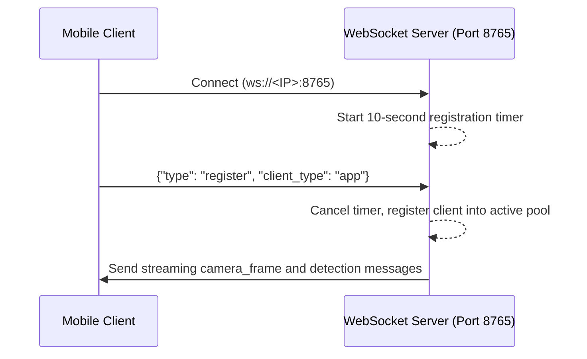

# WebSocket API Specification

What this page covers:
This page documents the network messaging protocols used by Farmer Eye.
It details every JSON message schema, the 10-second client registration handshake, ping/pong heartbeats, and port assignments for both edge servers.

---

## Protocol Overview

Farmer Eye uses standard WebSockets over TCP for low-latency communication between the edge server and client applications.

- **Combined Server (`src/combined_detection_stream.py`)**: Runs on port `8765`. Handles video streaming, client registration, and disease alert messages on a single port.
- **Dual Server (`src/real_time_detection.py`)**: Runs video streaming on port `8765` and driving command listeners on port `8766`.

---

## Client Connection Handshake (Port 8765)

When a client connects to `combined_detection_stream.py`, it must complete a registration handshake within 10 seconds:



If a client does not send the registration payload within 10.0 seconds, the server closes the connection to protect system resources.

---

## Message Schemas: Combined Server (`combined_detection_stream.py`)

### 1. `register` (Client -> Server)
Sent by a newly connected mobile client to declare its identity.

**When Sent**: Within 10 seconds of opening the WebSocket connection.

**JSON Example**:
```json
{
  "type": "register",
  "client_type": "app"
}
```

| Field | Type | Required | Description |
|---|---|:---:|---|
| `type` | String | Yes | Must be `"register"`. |
| `client_type` | String | Yes | Client identifier, typically `"app"`. |

---

### 2. `camera_frame` (Server -> Client)
Broadcasts live video images encoded as JPEG text.

**When Sent**: Continuously during streaming (~20 times per second).

**JSON Example**:
```json
{
  "type": "camera_frame",
  "image": "/9j/4AAQSkZJRgABAQAAAQABAAD...",
  "fps": 19.8
}
```

| Field | Type | Description |
|---|---|---|
| `type` | String | Message identifier: `"camera_frame"`. |
| `image` | String | Base64-encoded ASCII string containing JPEG image bytes. |
| `fps` | Float | Measured streaming frame rate over the last interval. |

---

### 3. `detection` (Server -> Client)
Transmits a positive disease diagnosis with bilingual treatment instructions.

**When Sent**: When the model detects a disease with confidence $\ge 98\%$ and the 2.0-second cooldown has elapsed.

**JSON Example**:
```json
{
  "type": "detection",
  "disease": "Tomato___Early_blight",
  "confidence": 0.985,
  "treatment_en": "Apply copper-based fungicides at first sign of symptoms.",
  "treatment_ar": "استخدم مبيدات فطرية نحاسية عند ظهور أول علامات الإصابة.",
  "resources": "Ensure adequate spacing between plants to reduce humidity.",
  "image": "/9j/4AAQSkZJRgABAQ..."
}
```

| Field | Type | Description |
|---|---|---|
| `type` | String | Message identifier: `"detection"`. |
| `disease` | String | Canonical disease name from `src/class_names.py`. |
| `confidence` | Float | Model softmax probability score (between 0.98 and 1.0). |
| `treatment_en` | String | Advisory treatment text in English from the database. |
| `treatment_ar` | String | Advisory treatment text in Arabic from the database. |
| `resources` | String | Chemical and agronomic guidelines from the database. |
| `image` | String | Optional Base64-encoded JPEG snapshot of the diseased crop. |

---

### 4. `no_detection` (Server -> Client)
Confirms that the system is operating but no crop pathology was identified.

**When Sent**: When inference produces a "healthy" label or prediction confidence is below the 98% threshold.

**JSON Example**:
```json
{
  "type": "no_detection",
  "message": "No disease detected or confidence below threshold"
}
```

| Field | Type | Description |
|---|---|---|
| `type` | String | Message identifier: `"no_detection"`. |
| `message` | String | Informational status string. |

---

### 5. `ping` and `pong` (Both Directions)
Maintains connection liveness across local network routers.

**When Sent**: Periodically by the server or client to test latency.

**JSON Example**:
```json
{
  "type": "ping"
}
```
**Response**:
```json
{
  "type": "pong"
}
```

---

## Message Schemas: Legacy Dual-Port Server (`real_time_detection.py`)

### Video Feed (Port 8765)
The video server in `real_time_detection.py` broadcasts frames using the message identifier `"frame"`:

```json
{
  "type": "frame",
  "data": "/9j/4AAQSkZJRgABAQ..."
}
```

### Motor Control (Port 8766)
The control listener receives vehicle driving commands.

*Note: Motor driver execution code is not included in this repository. Commands received on this port are logged or handled by external hardware modules.*

**Client Commands**:
- `forward`: Moves rover forward.
- `backward`: Moves rover in reverse.
- `left`: Turns rover left.
- `right`: Turns rover right.
- `stop`: Halts all motors.

---

## Next Steps

- Explore how treatment strings are organized in [Treatment Database](treatment-database.md).
- Understand how these messages are generated in [How It Works](how-it-works.md).
- Check installation and connection steps in [Getting Started](getting-started.md).
